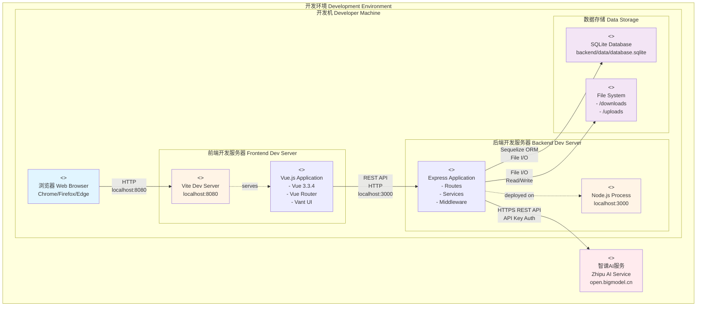
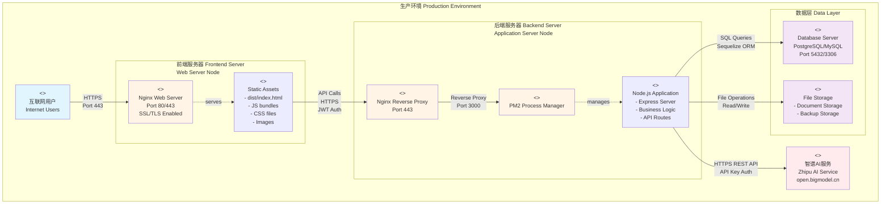

# Design Document - Deployment Architecture Diagram Standardization

## Overview

This design document outlines the approach for creating a standards-compliant deployment architecture diagram for the 求职导航 (Job Navigation) platform. The design follows UML deployment diagram conventions and software engineering best practices, providing clear visualization of system components, their deployment locations, and interactions.

## Architecture

### Diagram Structure

The deployment architecture will consist of:

1. **Multi-tier Architecture Visualization**
   - Presentation Tier (Frontend)
   - Application Tier (Backend API)
   - Data Tier (Database)
   - External Services Tier (Third-party APIs)

2. **Environment-Specific Diagrams**
   - Development Environment Deployment
   - Production Environment Deployment

3. **Component Deployment Mapping**
   - Node specifications
   - Artifact deployments
   - Communication protocols

### Design Principles

1. **UML Compliance**: Follow UML 2.5 deployment diagram standards
2. **Clarity**: Use clear, unambiguous notation and labeling
3. **Completeness**: Include all relevant deployment information
4. **Maintainability**: Use Mermaid syntax for version control and easy updates
5. **Bilingual Support**: Provide Chinese and English labels

## Components and Interfaces

### Node Types

#### 1. Client Node (用户设备)
- **Type**: <<device>>
- **Description**: User's web browser
- **Artifacts**: None (renders frontend application)
- **Interfaces**: HTTP/HTTPS client

#### 2. Frontend Server Node (前端服务器)
- **Type**: <<execution environment>>
- **Description**: Serves the Vue.js application
- **Development**: Vite Dev Server (localhost:8080)
- **Production**: Nginx/Apache web server
- **Artifacts**:
  - Vue.js application bundle
  - Static assets (CSS, images, fonts)
  - index.html entry point

#### 3. Backend API Server Node (后端API服务器)
- **Type**: <<execution environment>>
- **Description**: Node.js runtime executing Express application
- **Development**: Node.js process (localhost:3000)
- **Production**: PM2-managed Node.js process behind Nginx reverse proxy
- **Artifacts**:
  - Express application
  - Route handlers
  - Business logic services
  - Middleware components

#### 4. Database Node (数据库服务器)
- **Type**: <<execution environment>>
- **Description**: Database management system
- **Development**: SQLite file-based database
- **Production**: SQLite or PostgreSQL/MySQL
- **Artifacts**:
  - Database schema
  - Stored data files

#### 5. File Storage Node (文件存储)
- **Type**: <<execution environment>>
- **Description**: File system for document storage
- **Location**: Local filesystem or cloud storage
- **Artifacts**:
  - Uploaded resume files
  - Generated Word documents
  - Temporary files

#### 6. External AI Service Node (外部AI服务)
- **Type**: <<external system>>
- **Description**: Zhipu AI API service
- **Endpoint**: https://open.bigmodel.cn
- **Artifacts**: None (external service)

### Communication Paths

1. **Client ↔ Frontend Server**
   - Protocol: HTTP/HTTPS
   - Port: 8080 (dev), 80/443 (prod)
   - Content: HTML, CSS, JavaScript, images

2. **Frontend ↔ Backend API**
   - Protocol: HTTP/HTTPS REST API
   - Port: 3000 (dev), 443 (prod via reverse proxy)
   - Content: JSON payloads
   - Authentication: JWT tokens in headers

3. **Backend API ↔ Database**
   - Protocol: Database-specific (SQLite file access, PostgreSQL wire protocol)
   - Connection: Local file or TCP/IP
   - ORM: Sequelize

4. **Backend API ↔ File Storage**
   - Protocol: File system I/O
   - Operations: Read, write, delete

5. **Backend API ↔ External AI Service**
   - Protocol: HTTPS REST API
   - Authentication: API key in headers
   - Content: JSON requests/responses

## Data Models

### Deployment Configuration Data

```javascript
// Development Environment Configuration
{
  frontend: {
    host: "localhost",
    port: 8080,
    protocol: "http",
    buildTool: "Vite"
  },
  backend: {
    host: "localhost",
    port: 3000,
    protocol: "http",
    runtime: "Node.js",
    processManager: "node"
  },
  database: {
    type: "SQLite",
    location: "backend/data/database.sqlite"
  }
}

// Production Environment Configuration
{
  frontend: {
    host: "your-domain.com",
    port: 443,
    protocol: "https",
    server: "Nginx",
    ssl: true
  },
  backend: {
    host: "api.your-domain.com",
    port: 443,
    protocol: "https",
    runtime: "Node.js",
    processManager: "PM2",
    reverseProxy: "Nginx"
  },
  database: {
    type: "PostgreSQL", // or SQLite
    host: "db.internal",
    port: 5432
  }
}
```

### Node Specifications

```yaml
# Frontend Server Specification
frontend_node:
  hardware:
    cpu: "2 cores"
    memory: "2 GB RAM"
    storage: "10 GB SSD"
  software:
    os: "Linux (Ubuntu 20.04+) / Windows Server"
    webserver: "Nginx 1.18+ / Apache 2.4+"
    node_version: "14+" # for build process
  network:
    ports: [80, 443]
    firewall: "Allow inbound HTTP/HTTPS"

# Backend Server Specification
backend_node:
  hardware:
    cpu: "4 cores"
    memory: "4 GB RAM"
    storage: "50 GB SSD"
  software:
    os: "Linux (Ubuntu 20.04+)"
    runtime: "Node.js 14+"
    process_manager: "PM2"
    reverse_proxy: "Nginx 1.18+"
  network:
    ports: [3000, 443]
    firewall: "Allow inbound HTTPS, internal port 3000"

# Database Specification
database_node:
  hardware:
    cpu: "2 cores"
    memory: "4 GB RAM"
    storage: "100 GB SSD"
  software:
    os: "Linux (Ubuntu 20.04+)"
    database: "SQLite 3 / PostgreSQL 12+"
  network:
    ports: [5432] # if PostgreSQL
    firewall: "Internal network only"
```

## Diagram Design

### Development Environment Deployment Diagram



### Production Environment Deployment Diagram



## Error Handling

### Deployment Failure Scenarios

1. **Frontend Deployment Failure**
   - Rollback to previous version
   - Verify build artifacts integrity
   - Check web server configuration

2. **Backend Deployment Failure**
   - PM2 automatic restart
   - Health check endpoint monitoring
   - Rollback to stable version

3. **Database Migration Failure**
   - Transaction rollback
   - Backup restoration
   - Manual intervention required

4. **External Service Unavailability**
   - Graceful degradation
   - Error messages to users
   - Retry mechanism with exponential backoff

## Testing Strategy

### Deployment Verification

1. **Pre-Deployment Testing**
   - Build verification
   - Unit tests pass
   - Integration tests pass
   - Security scan

2. **Post-Deployment Testing**
   - Health check endpoints
   - Smoke tests
   - End-to-end critical path testing
   - Performance baseline verification

3. **Monitoring**
   - Application logs
   - Error tracking
   - Performance metrics
   - User analytics

### Deployment Checklist

- [ ] Backup current production data
- [ ] Build and test artifacts in staging
- [ ] Update environment variables
- [ ] Deploy database migrations
- [ ] Deploy backend application
- [ ] Deploy frontend application
- [ ] Verify health checks
- [ ] Run smoke tests
- [ ] Monitor error rates
- [ ] Document deployment in changelog

## Security Considerations

1. **Network Security**
   - HTTPS/TLS for all external communication
   - Firewall rules limiting access
   - Internal network isolation

2. **Authentication & Authorization**
   - JWT token validation
   - Password hashing (bcrypt)
   - API key protection

3. **Data Security**
   - Database encryption at rest
   - Secure file storage permissions
   - Regular backups

4. **External Service Security**
   - API key rotation
   - Rate limiting
   - Request validation

## Deployment Process

### Development Deployment

1. Start frontend dev server: `npm run dev` (port 8080)
2. Start backend server: `node server.js` (port 3000)
3. Database auto-initializes on first run
4. Access application at http://localhost:8080

### Production Deployment

1. **Build Phase**
   ```bash
   # Frontend
   npm run build  # Creates dist/ directory
   
   # Backend
   npm install --production
   ```

2. **Deploy Phase**
   ```bash
   # Frontend: Copy dist/ to web server
   scp -r dist/* user@server:/var/www/html/
   
   # Backend: Deploy and start with PM2
   pm2 start server.js --name job-navigation-api
   pm2 save
   ```

3. **Verification Phase**
   - Check health endpoints
   - Verify database connectivity
   - Test critical user flows
   - Monitor logs for errors

## Scalability Considerations

### Horizontal Scaling

- Frontend: Multiple web server instances behind load balancer
- Backend: Multiple API server instances with PM2 cluster mode
- Database: Read replicas for query distribution

### Vertical Scaling

- Increase server resources (CPU, RAM)
- Optimize database queries
- Implement caching (Redis)

### Performance Optimization

- CDN for static assets
- Database query optimization
- API response caching
- Lazy loading for frontend components
